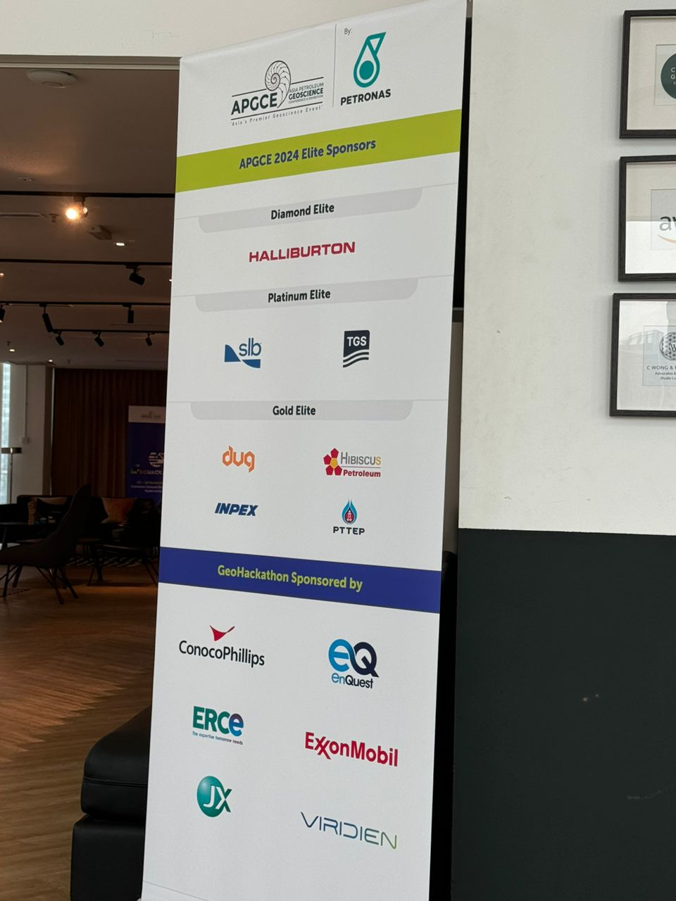

# APGCE-Hackathon-2024 - Seismic Fault Image Segmentation

Date: 16-18 Nov 2024   
Location: Common Ground Bukit Bintang, KL  
Orgainized by: 
- Asia Petroleum GeoScience Conference & Exhibition 
- Petronas 

# Meet the Team

From left to right: Izzudin Hussein (Data Scientist), Lim Chun Yan (Reservoir Engineer), Max Wei Xiang Ooi (Data Scientist), Teo Sheng Pu (Data Engineer), Zulfadhi Mohd Zaki (Geoscientist)

# Challenge Background 
Faults are cracks within the Earth's crust that may help provide conduits for hydrocarbon migration into a trap or stop hydrocarbon on its migration path. Horizons are distinct rock layers that represent different periods of deposition and help geologists track how hydrocarbons move through the subsurface. Understanding these faults are crucial for geologists in the oil and gas exploration.

In 3D seismic, faults are relatively easier to interpret compared to 2D seismic due to data continuity across an area of interest. Similarly, horizons are more confidently tracked in 3D seismic as the continuous data allows geologists to follow the same geological layer across the volume. For examples, in a producing field or exploration in a mature basin. In frontier exploration, geologists oftentimes are constrained with only 2D seismic in the form of discrete lines (inline and crossline).

<b>Challenge 1</b>: build and train a computer vision model that can <b> predict the propagation of faults </b> across a given 2D seismic dataset.

<b>Challenge 2</b>: build and train a computer vision model that can <b> predict the propagation of horizons </b> across a given 2D seismic dataset.

At the end of the 48 hours, you are given 10 minutes to present your solution to the judges. The final product will then be uploaded to and made available in a public repository. 

Full info: 

# Our Approach

| Challenges | Steps  |
| ---------- | -----  |
| Knowledge Gap | 1. Upskilling on Seismic Domain Knowledge   2. Upskilling on Image Processing   3. Upskilling on Deep Learning modeling |
| Imbalanced Dataset |1. Image Cropping   2. Enhanced Focal Loss with alpha (focus on minority data)   3. Weighted F1 Score Evaluation Metrics |
| Constrains on computation power   (16 MiB GPU) | 1. Code Optimization with coding best practices   2. Image Size Reduction    3. Image Cropping    4. Batch Size Hyperparameter tunning|
| Handling Overfitting | 1. Hyperparameter tunning on Learning Rate | 
| Lost of direction and motivation after long working hours | 1. Peer motivation   2. Pair mentoring   3. Pair programming |

## Image enhancement to highlight contours 

## Fault Thickening to address sparse target data and improve learning

## Image Cropping
Models are trained using samples of the whole images of fixed dimention (512x512). When a full scale image is passed into the model wrapper, it is right and bottom padded, and then split into grids of the same dimension. Each grid is predicted independently, and the final predictions are combined to give an overall mask.

# Results

Left = Enhanced Focal loss function   
Middle = Weighted F1 Score  
Right = Sample prediction on validation dataset   

## Validation on holdout data

- Looks like more training are required 
- Looks like we have too much penalty on the fault (0.1 for background, 0.9 for fault)

# How to use

### Basic Execution
Open a terminal/cmd, change directory to the repository folder, and run the following command to generate the model file into staging folder.
`cat model/splitted-model/model* > staging/model.pt`

Edit the file path within staging/wrapper.py, and execute in terminal/cmd. If successful, the output image will be produced in the staging folder.

### Data Preparation
A small dataset of 10 images are included in data/raw_XXX folders. Preparation steps and visualization are available in data_prep folder.

### Modeling
Modeling folder contains the code to train and evaluate a model.

# Resources
1. [Final presentation](/doc/DSGS_101.pdf)
2. [Challenge briefing](/doc/GeoHackathon%202024%20Challenge%20Brief.pdf)

# Sponsors

